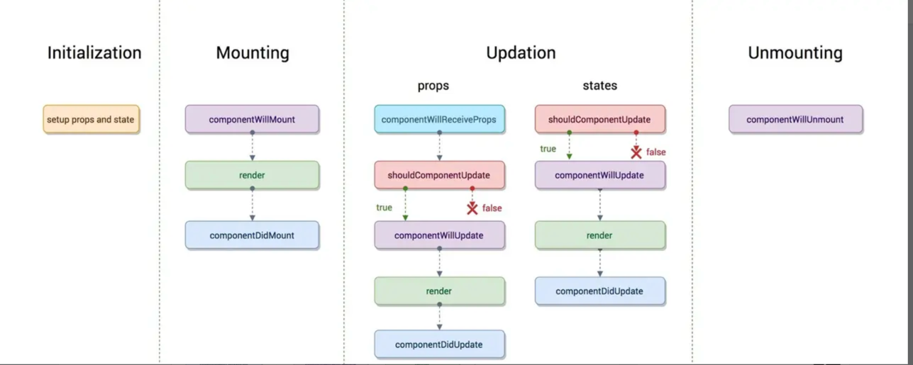

----

## 1.父子组件传值(类组件)

### 父组件调用子组件方法及传参

**父组件:**

```js
export default class Fz extends Component {
  handleF=()=>{
     this.refsz.method('父组件调用了')
  }
  render() {
    return (
      <div >
        <Button onClick={this.handleF}>父组件按钮</Button>
        <Add refsZ={el=>this.refsz=el}/>
      </div>
    )
  }
}
```

**子组件:**

```js
export default class Add extends Component {
  componentDidMount() {
    this.props.refsZ(this)
  }
  method(arg){
      console.log(arg,'子组件的方法')
  }
    render() {
        return  <></>
    }
}
```

### 子组件调用父组件方法及传参


**父组件:**

```js
export default class Fz extends Component {
  handleF=(...arg)=>{
     console.log(arg,'(我是父组件方法)')
  }
  render() {
    return (
      <div >
        <Add click={this.handleF}/>
      </div>
    )
  }
}
```

**子组件:**

```js
export default class Add extends Component {
  handleClick=(e)=>{
    this.props.click('(子组件调用父组件方法给父组件传值)','(方案2)',e)
  }
    render() {
    const {click} = this.props
        return  <>
          <Button onClick={click.bind(this,'(子组件调用父组件方法给父组件传值)','(方案1)')}>
          	我是子组件的按钮1
          </Button>
          <Button onClick={this.handleClick}>我是子组件的按钮2</Button>
        </>
    }
}
```

## 2.ref获取DOM(类组件)

```js
export default class Fz extends Component {
  constructor(props) {
    super(props);
    this.MyRef = React.createRef()
  }
  handleClick=_=>{
    console.log(this.MyRef.current.value)
  }
  render() {
    return (
      <div>
        <input type="text" ref={this.MyRef}/>
        <Button onClick={this.handleClick}>获取</Button>
      </div>
    )
  }
}
```

## 3.React 中的 props 是什么state是什么?

>**props**

**`props(只读组件)`是一个从外部传进组件的参数，主要作为就是从父组件向子组件传递数据，它具有可读性和不变性，只能通过外部组件主动传入新的`props`来重新渲染子组件，否则子组件的`props`以及展现形式不会改变。**

>**state**

**`state(状态)`的主要作用是用于组件保存、控制以及修改自己的状态，它只能在`constructor`中初始化，它算是组件的私有属性，不可通过外部访问和修改，只能通过组件内部的`this.setState`来修改，修改`state`属性会导致组件的重新渲染。**

**区别**

1. `state`是组件自己管理数据，控制自己的状态，可变；
2. `props`是外部传入的数据参数，不可变；
3. 没有`state`的叫做无状态组件，有`state`的叫做有状态组件；
4. 多用`props`，少用`state`。也就是多写无状态组件。
5. `props`用于定义外部接口，`state`用于记录内部状态
6. `props`的赋值在于外部世界使用组件，`state`的赋值在于组件内部
7. 组件不应该改变`props`的值，而`state`存在的目的就是让组件来修改的

## 4.生命周期



> **React 16.3+**

- **getDerivedStateFromProps(nextProps, prevState):** 在调用`render()`之前调用，并在 *每次* 渲染时调用。 需要使用派生状态的情况是很罕见得。值得阅读 [如果你需要派生状态](https://reactjs.org/blog/2018/06/07/you-probably-dont-need-derived-state.html).
- **componentDidMount:** 首次渲染后调用，所有得 Ajax 请求、DOM 或状态更新、设置事件监听器都应该在此处发生。
- **shouldComponentUpdate:** 确定组件是否应该更新。 默认情况下，它返回`true`。 如果你确定在更新状态或属性后不需要渲染组件，则可以返回`false`值。 它是一个提高性能的好地方，因为它允许你在组件接收新属性时阻止重新渲染。
- **getSnapshotBeforeUpdate(nextProps, prevState):** 在最新的渲染输出提交给 DOM 前将会立即调用，这对于从 DOM 捕获信息（比如：滚动位置）很有用。
- **componentDidUpdate:** 它主要用于更新 DOM 以响应 prop 或 state 更改。 如果`shouldComponentUpdate()`返回`false`，则不会触发。
- **componentWillUnmount** 当一个组件被从 DOM 中移除时，该方法被调用，取消网络请求或者移除与该组件相关的事件监听程序等应该在这里进行。

> **Before 16.3**

- **componentWillMount:** 在组件`render()`前执行，用于根组件中的应用程序级别配置。应该避免在该方法中引入任何的副作用或订阅。
- **componentDidMount:** 首次渲染后调用，所有得 Ajax 请求、DOM 或状态更新、设置事件监听器都应该在此处发生。
- **componentWillReceiveProps (nextProps):** 在组件接收到新属性前调用，若你需要更新状态响应属性改变（例如，重置它），你可能需对比`this.props`和`nextProps`并在该方法中使用`this.setState()`处理状态改变。
- **shouldComponentUpdate(nextProps,nextState):** 确定组件是否应该更新。 默认情况下，它返回`true`。 如果你确定在更新状态或属性后不需要渲染组件，则可以返回`false`值。 它是一个提高性能的好地方，因为它允许你在组件接收新属性时阻止重新渲染。
- **componentWillUpdate (nextProps,nextState):** 当`shouldComponentUpdate`返回`true`后重新渲染组件之前执行，注意你不能在这调用`this.setState()`
- **componentDidUpdate(prevProps,prevState):** 它主要用于更新 DOM 以响应 prop 或 state 更改。 如果`shouldComponentUpdate()`返回`false`，则不会触发。
- **componentWillUnmount:** 当一个组件被从 DOM 中移除时，该方法被调用，取消网络请求或者移除与该组件相关的事件监听程序等应该在这里进行。

## 5.什么是高阶组件（HOC）?

*高阶组件*(*HOC*) 就是一个函数，且该函数接受一个组件作为参数，并返回一个新的组件，它只是一种模式，这种模式是由`react`自身的组合性质必然产生的。

我们将它们称为**纯组件**，因为它们可以接受任何动态提供的子组件，但它们不会修改或复制其输入组件中的任何行为。

```js
const EnhancedComponent = higherOrderComponent(WrappedComponent)
```

**HOC 有很多用例：**

1. 代码复用，逻辑抽象化
2. 渲染劫持
3. 抽象化和操作状态（`state`）
4. 操作属性（`props`）

## 6.如何实现 Server Side Rendering 或 SSR?

React 已经配备了用于处理 Node 服务器上页面渲染的功能。你可以使用特殊版本的 DOM 渲染器，它遵循与客户端相同的模式。

```js
import ReactDOMServer from 'react-dom/server'

import App from './App'

ReactDOMServer.renderToString(<App />)
```

此方法将以字符串形式输出常规 HTML，然后将其作为服务器响应的一部分放在页面正文中。在客户端，React 检测预渲染的内容并无缝地衔接。

## 7.最流行的动画软件包是什么?

***React Transition Group*** 和 ***React Motion*** 是React生态系统中流行的动画包。

## 8.redux

### Redux 遵循三个基本原则：

1. **单一数据来源：** 整个应用程序的状态存储在单个对象树中。单状态树可以更容易地跟踪随时间的变化并调试或检查应用程序。
2. **状态是只读的：** 改变状态的唯一方法是发出一个动作，一个描述发生的事情的对象。这可以确保视图和网络请求都不会直接写入状态。
3. **使用纯函数进行更改：** 要指定状态树如何通过操作进行转换，您可以编写reducers。Reducers 只是纯函数，它将先前的状态和操作作为参数，并返回下一个状态。

**工作流程**

**工作流程**是 view 调用 store 的 dispatch 接收 action 传入 store，reducer 进行 state 操作，view 通过 store 提供的 getState 获取最新的数据

